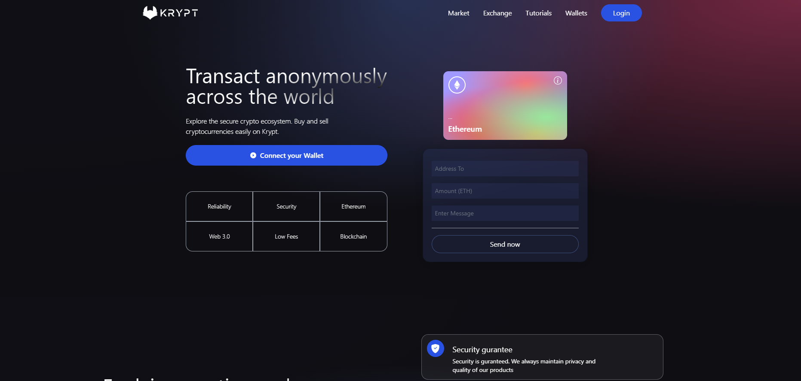
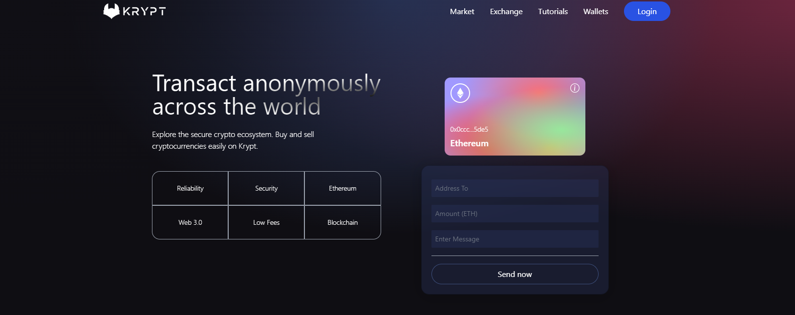
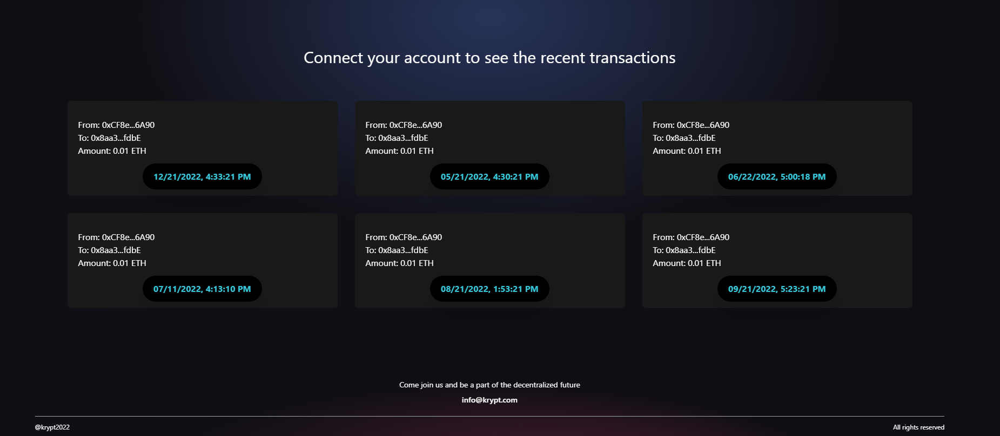

# Krypt - Metamask wallet integration

## Introduction:
The project was built to integrate metamask crypto account to any web2.0
application, and fetching all the recent transactions of the user from the
account linked.

## Technologies used:
web3.0, Ehters.js, Ethereum, Smart Contracts, React.js, TailwindCSS, Crypto
Wallet Integration, Metamask

Portfolio - https://alfredrodriguez98.github.io/

Inspiration from: Enyel Sequeira.